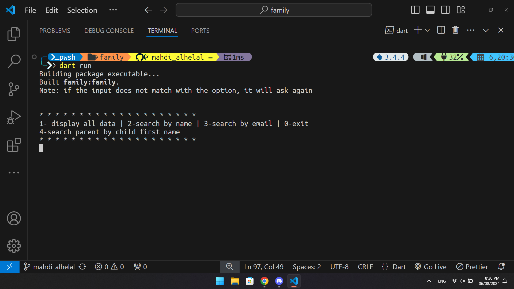
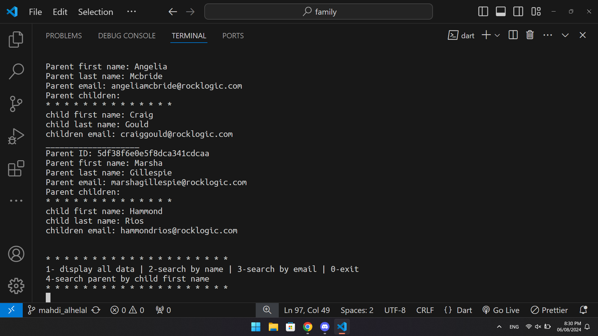
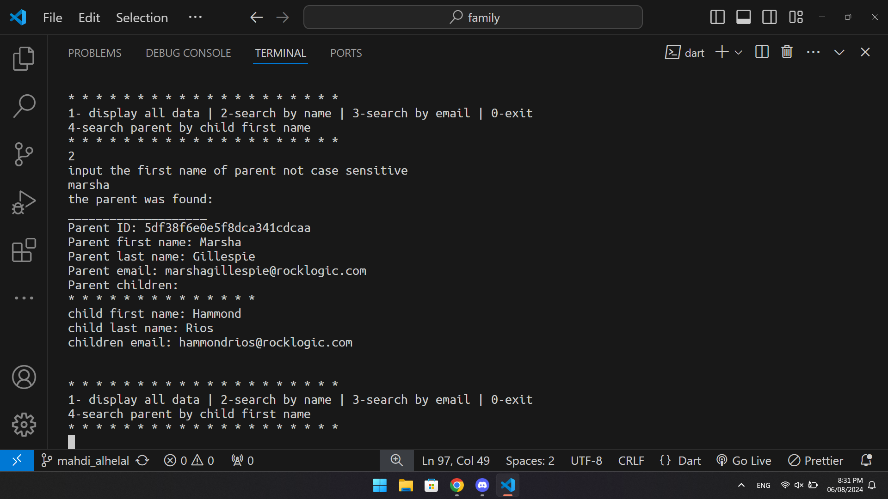
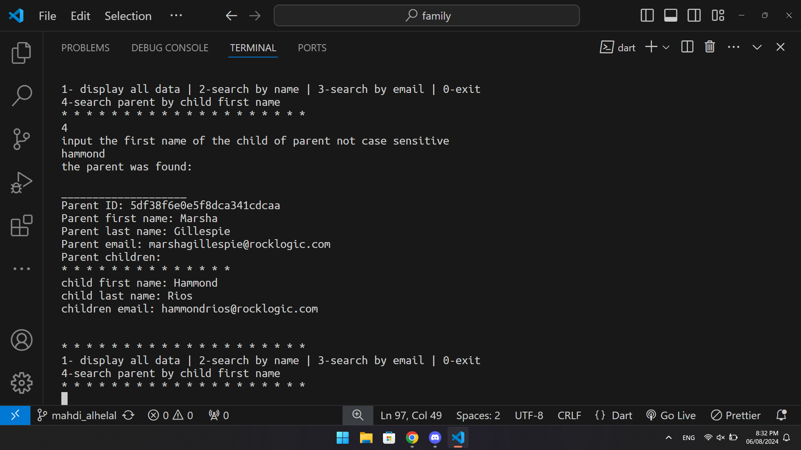

## About the app:

The CLI print the list of parent and their children by take for json file and covert to list  

## Motivation:
complete task provided by Tuwaiq Academy

## App:
### feature
1. Display all parent in the json 
2- search parent by first name, email and child first name

## How to use 
After lunch the CLI, it will promt you to choose between one of it features.
you can display all data or use one of three search 
1- search the parent by name of by it children
2- search parent by email

## Sample:
  

  
   
  
  
  

