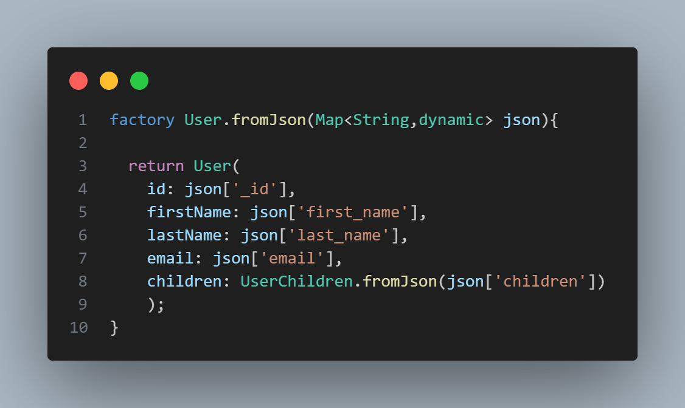
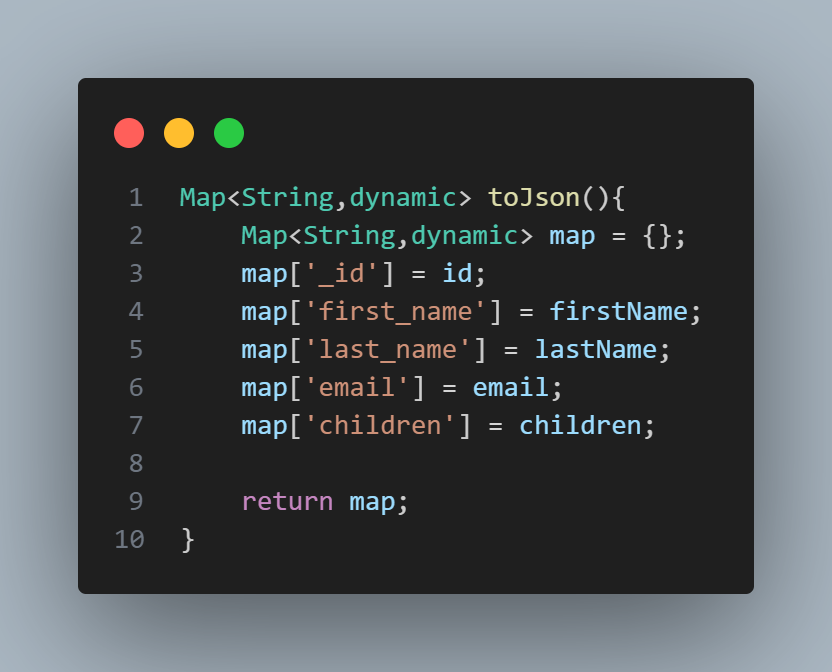
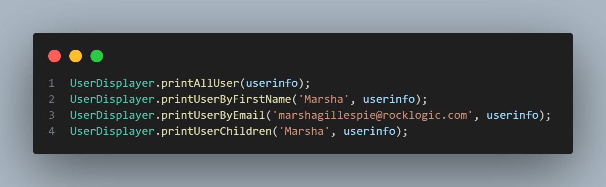

## Project Idea
a simple dart project that handle json users data that contain 
a list of map in this project we have class User that handle user
info from json data and class UserDisplayer to present this data
by using spicfic function .

### Main function 

#### .fromJson

##### Purpose:
 Converts a JSON object into a Dart object.
##### Usage: 
Typically used when you receive JSON data from an API or a file and need to convert it into a Dart object.

in this project we have 
factory constructer as shown below  :

#### .toJson

##### Purpose: 
 Converts a Dart object into a JSON object.
##### Usage: 
 Typically used when you need to send Dart object data to an API or save it in a file in JSON format.

in this project we have 
toJson function as shown below  :

#### Function

#### Output
user info :

childern for spicfic user :

