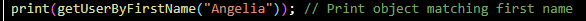
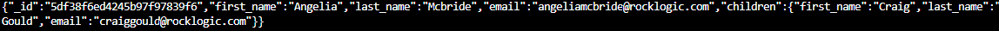
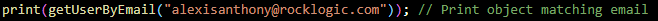
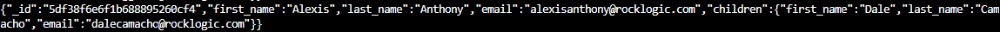
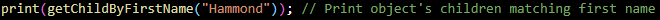
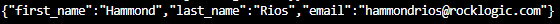

# Project Overview

This project implements functionalities to retrieve and display user information from a provided data set. It includes features for:

<ul>
<li>Displaying all users </li>
<li>Finding a user by first name </li>
<li>Finding a user by email </li>
<li>Finding a user's children by first name </li>
</ul>

# Preview

 here are some examples of how the functions work : 

---------------------------------------------------

---------------------------------------------------

