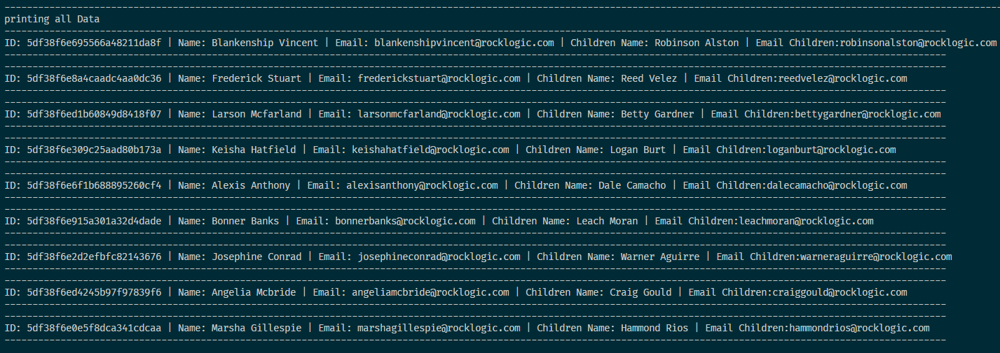
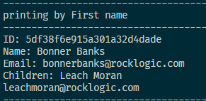
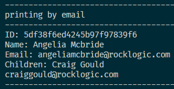
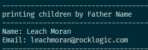

# Assignment 8 Json data

### this project about reading data from json and how to access into data.

#### i learnd how to get a data from json and how to access into it also how to set your variable based on showing data. 
<ht>

#### Code Style

<li>organization
<li>ease of maintenance
<li>Well-structured
<li>readable code

#### some explanation
<li>display all data

<li>display data by sending a specific name 

<li>display data by sending a specific email 

<li>display children by sending a specific father name

#### Formating style
<li>there's a file called printer_show used for displying a formating style to sort the print on main code.

