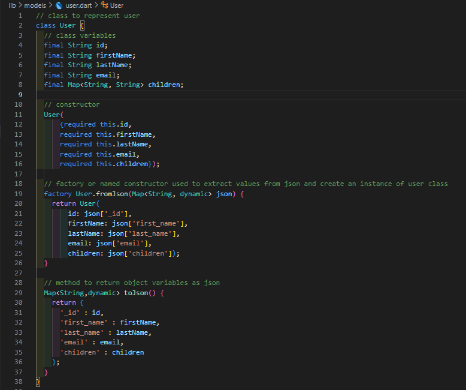
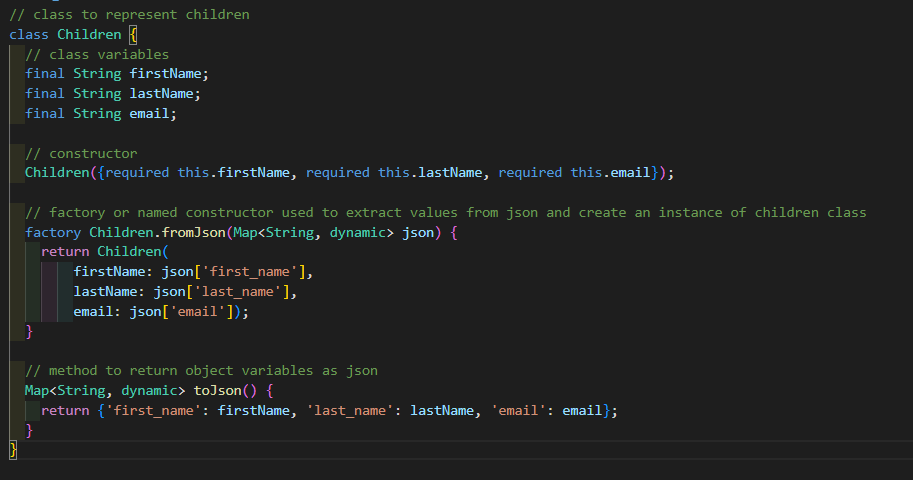
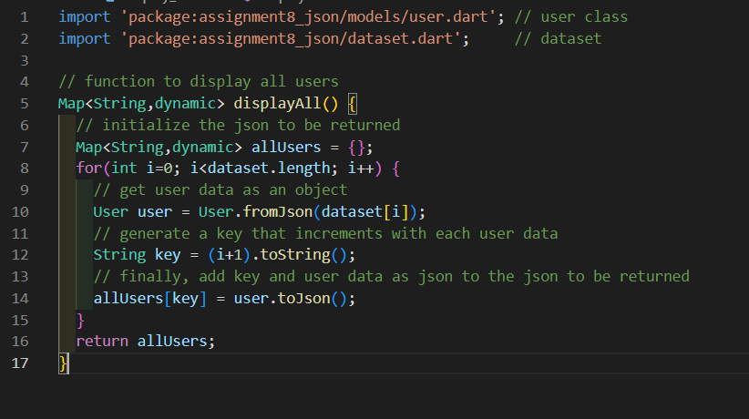
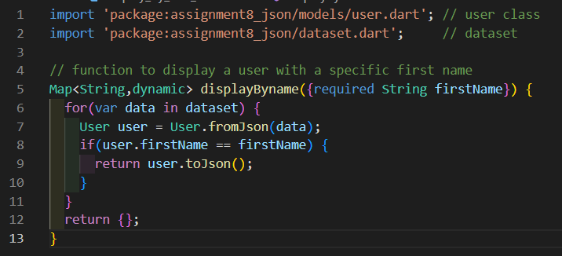
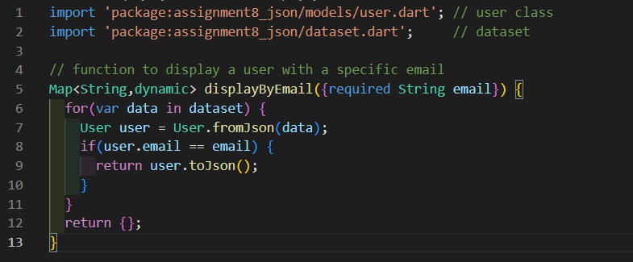
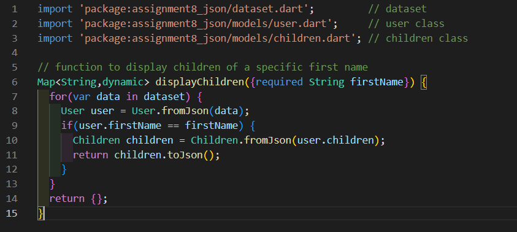

# Assignment 8 : Reading Json

# 1. Overview 📖
This assignment aims to improve data manipulation skills where we can read json data and handle them in a suitable way, for example by creating objects that refers to some keys in the json data.

# 2. Code and Implementation 💻
In this section, I will explain each class in details.

## 2.1 `User` class
`User` class represents a user, this class has 5 attributes which are the following :
- id
- firstName
- lastName
- email
- children

After setting the parameterized constructor of `User`, we provide a new concept which called `factory`. `factory` is basically a constructor which returns an instance of the object made after passing some source of data, for example in our assignment here we're using `json`.

As we provided a method "constructor" for reading json data, we should also provide a method to send or return json data, this can be done using `toJson` method.

## 2.2 `Children` class
`Children` class is used to represent a user children, it has 3 attributes which are the following :
- firstName
- lastName
- email

Same process applied on `User` class will be applied on `Children` class too.

## 2.3 create functions and test objects
We were required to build 4 functions which are described as follows :
- **2.3.1 displayAll**\
This function will return a json data containing all users in the dataset

 
 

- **2.3.2 displayByName**\
This function must accept a string "firstName" as a parameter and return a json data containing the object that has the same first name as the passed argument.

 
 

- **2.3.3 displayByEmail**\
this function must accept a string "email" as a parameter and return a json data containing the object that has the same email as the passed argument.

 
 

- **2.3.4 displayChildren**\
this function must accept a string "firstName" as a parameter and return a json data containing the children of a user with the same first name as the passed argument.

 
 

**Note** : All functions will return null in case of a no match or no data found.

# 3. Conclusion 🏁
This assignment will get us familiar with what is it like to perform data handling and reading from API.\
Dealing with API's is an important skill to have as a front-end developer.