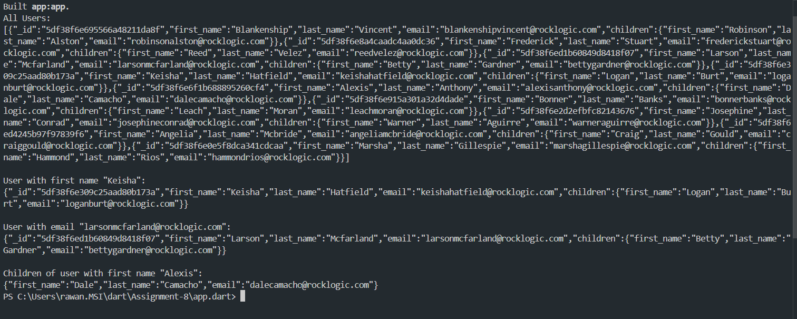

# User Management Dart Project

## Overview
This Dart project provides functionalities to manage and display user data from a JSON dataset. It includes:
- Displaying all users.
- Displaying a user by their first name.
- Displaying a user by their email.
- (Bonus) Displaying the children of a user by the user's first name.

- **models/user.dart**: Defines the `User` and `Child` classes.
- **user_manager.dart**: Contains the `UserManager` class with functions for handling user data.
- **app.dart**: Main entry point of the application, demonstrating the functionality.

## How to Run

1. **Clone the repository**:
   
2. **Navigate to the project directory**:
 
3. **Run the application**:

    dart run app.dart

## Functionality

### Display All Users-------------
To display all users, the `getAllUsers` function in the `UserManager` class is used. It returns a JSON string of all user objects.

### Display User by First Name---------------
To display a user by their first name, the `getUserByFirstName` function is used. Pass the first name as a parameter, and it returns a JSON string of the matching user object.

### Display User by Email----------------
To display a user by their email, the `getUserByEmail` function is used. Pass the email as a parameter, and it returns a JSON string of the matching user object.

### Bonus: Display Children by User's First Name----------
To display the children of a user by the user's first name, the `getChildrenByFirstName` function is used. Pass the user's first name as a parameter, and it returns a JSON string of the children object of the matching user.

## Example Output

