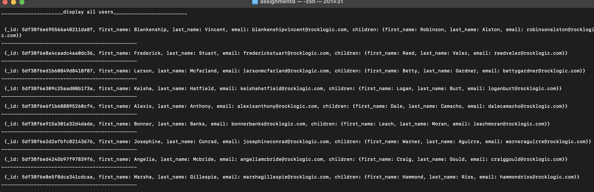
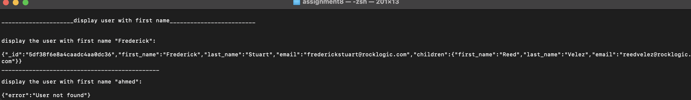
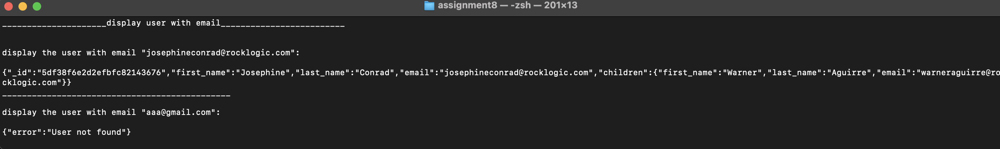
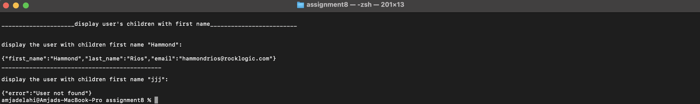

<p align="center">

<br/>

# Assignment 8

## Description

 Working with Json data to create functions to display all users, display one user by first_name, display one user by email.

## Requirements

 In order to run the application, this project requires a Dart SDK and a command line interface (CML).

## install dart SDK
 install dart SDK from [dart documentation](https://dart.dev/get-dart)

## How to run the project

1. Open terminal or CMD.
2. Navigate to the project path, such as 
```bash
cd /Users/amjadelahi/dart-bootCamp/Assignment-8/assignment8

```
 3. Run the application with a command: 
```bash
dart run
```
 4. The output of displaying all users is:
      
<p align="center">

<br/>

5. The output of displaying user with first name:

<p align="center">

<br/>

6. The output of displaying user with email:

<p align="center">

<br/>

7. The output of displaying user's children with first name:

<p align="center">

<br/>


